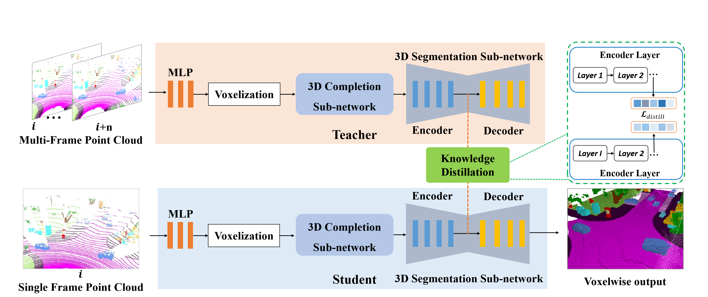

## SCPNet: Semantic Scene Completion on Point Cloud (CVPR 2023, Highlight)



## News
- **2023-05** Preliminary codes are released.
- **2023-02** Our SCPNet is accepted by CVPR 2023 (**Highlight**)!
- **2022-11** Our method ranks **1st** in **SemanticKITTI Semantic Scene Completion Challenge**, with mIoU=36.7. 
- SCPNet is comprised of a novel completion sub-network without an encoder-decoder structure and a segmentation sub-network obtained by replacing the cylindrical partition of Cylinder3D with conventional cubic partition.


## Installation

### Requirements
- PyTorch >= 1.10 
- pyyaml
- Cython
- tqdm
- numba
- Numpy-indexed
- [torch-scatter](https://github.com/rusty1s/pytorch_scatter)
- [spconv](https://github.com/tyjiang1997/spconv1.0) (tested with spconv==1.0 and cuda==11.3)

## Data Preparation

### SemanticKITTI
```
./
├── 
├── ...
└── path_to_data_shown_in_config/
    ├──sequences
        ├── 00/           
        │   ├── velodyne/	
        |   |	├── 000000.bin
        |   |	├── 000001.bin
        |   |	└── ...
        │   └── labels/ 
        |       ├── 000000.label
        |       ├── 000001.label
        |       └── ...
        │   └── voxels/ 
        |       ├── 000000.bin
        |       ├── 000000.label
        |       ├── 000000.invalid
        |       ├── 000000.occluded
        |       ├── 000001.bin
        |       ├── 000001.label
        |       ├── 000001.invalid
        |       ├── 000001.occluded
        |       └── ...
        ├── 08/ # for validation
        ├── 11/ # 11-21 for testing
        └── 21/
	    └── ...
```
## Test
We take evaluation on the SemanticKITTI test set (single-scan) as example.
1. Download the pre-trained models and put them in ```./model_load_dir```.
2. Set val_data_loader>imageset: “test” in the configuration file ```config/semantickitti-multiscan.yaml```.
3. Generate predictions on the SemanticKITTI test set.
```
CUDA_VISIBLE_DEVICES=0 python -u test_scpnet_comp.py
```
The model predictions will be saved in ```./out_scpnet/test``` by default.

## Train
1. Set val_data_loader>imageset: “test” in the configuration file ```config/semantickitti-multiscan.yaml```.
2. train the network by running the train script
```
CUDA_VISIBLE_DEVICES=0 python -u train_scpnet_comp.py
```

## Citation

If you use the codes, please cite the following publication:
```
@inproceedings{scpnet,
    title     = {SCPNet: Semantic Scene Completion on Point Cloud},
    author    = {Xia, Zhaoyang and Liu, Youquan and Li, Xin and Zhu, Xinge and Ma, Yuexin and Li, Yikang and Hou, Yuenan and Qiao, Yu},
    booktitle = {IEEE Conference on Computer Vision and Pattern Recognition},
    year      = {2023}
}
```

## Acknowledgements
We thanks for these codebases, including [Cylinder3D](https://github.com/xinge008/Cylinder3D), [PVKD](https://github.com/cardwing/Codes-for-PVKD) and [spconv](https://github.com/traveller59/spconv).
